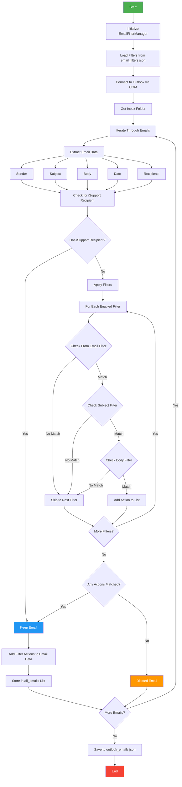
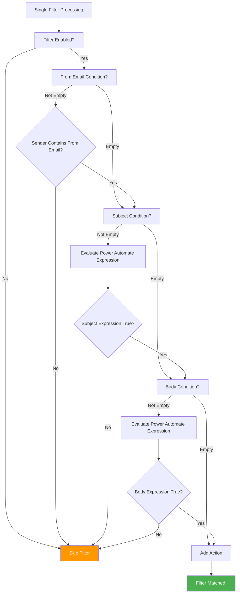

# Email Filter System Flowchart



## Filter Processing Detail



## Power Automate Expression Evaluation

```mermaid
flowchart TD
    A[Expression: contains(subject, 'Alert')] --> B[Parse Function Call]
    B --> C[Extract Function: contains]
    B --> D[Extract Arguments: subject, 'Alert']
    
    D --> E[Replace Variables]
    E --> E1[subject → Actual Email Subject]
    E --> E2['Alert' → 'Alert']
    
    E1 --> F[Call contains function]
    F --> G{subject.lower().contains('alert'.lower())}
    G -->|True| H[Return True]
    G -->|False| I[Return False]
    
    style H fill:#4CAF50,color:#fff
    style I fill:#f44336,color:#fff
```

## Key Components

### 1. EmailFilterManager Class
- **Load Filters**: Reads `email_filters.json`
- **Apply Filters**: Tests each email against all enabled filters
- **Evaluate Expressions**: Processes Power Automate-like expressions

### 2. Filter Conditions
- **From Email**: Simple string match in sender field
- **Subject Filter**: Power Automate expression evaluation
- **Body Filter**: Power Automate expression evaluation

### 3. Power Automate Functions Supported
- `equals(value1, value2)`
- `contains(text, search)`
- `startsWith(text, prefix)`
- `endsWith(text, suffix)`
- `concat(*args)`
- `substring(text, start, length)`
- `indexOf(text, search)`
- `split(text, separator)`

### 4. Data Flow
1. **Input**: Outlook emails via COM
2. **Processing**: Filter application with expression evaluation
3. **Output**: JSON file with filtered emails and actions

### 5. Filter Storage
```json
{
    "id": 1,
    "name": "MX Alert Filter",
    "from_email": "system.MX@hkt-emsconnect.com",
    "subject_filter": "contains(subject, 'Alert')",
    "body_filter": "contains(body, 'error')",
    "action": "send_to_support_team",
    "enabled": true
}
```

## Decision Points

1. **iSupport Check**: Emails sent to "iSupport" are always kept
2. **Filter Matching**: Email must pass ALL conditions in a filter
3. **Multiple Filters**: Email can match multiple filters (AND logic)
4. **Action Collection**: All matching filter actions are collected